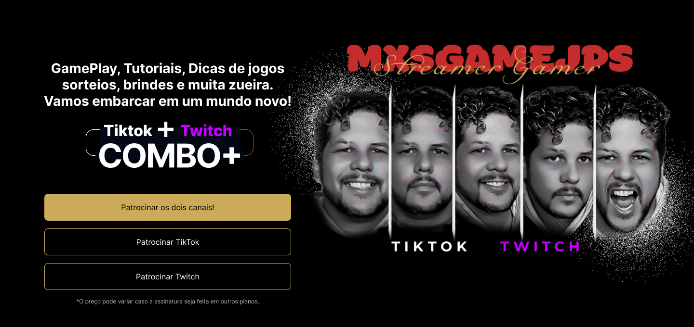

# Página de Captura de Patrocínios 🎮✨

Este repositório contém o código-fonte da **Página de Captura de Patrocínios**, desenvolvida para promover canais de games. O objetivo é oferecer uma experiência imersiva para patrocinadores, com informações claras, botões de ação e compatibilidade com diversos dispositivos.

## 🛠️ Tecnologias Utilizadas

- **HTML5**: Para a estruturação do conteúdo.
- **CSS3**: Para o design responsivo e estilização avançada.
- **Flexbox**: Para alinhamento e layout flexível.

## 🌟 Recursos da Página

- **Design Moderno**: Interface intuitiva e visualmente atraente.
- **Compatibilidade Multi-Dispositivos**: TV, computadores, tablets e smartphones.
- **Brindes Exclusivos**: Vantagens para patrocinadores, como itens personalizados.
- **Ação Direta**: Botões para patrocínios em diferentes plataformas.

## 📂 Estrutura de Arquivos
├── index.html ├── estilos/ │ └── estilos.css ├── assets/ │ ├── Background.png │ ├── Combo.png │ ├── Plataformas.png │ ├── brindes.png │ ├── telas.png │ ├── tv.png │ ├── computador.png │ ├── celular.png │ ├── logo.png │ └── Behance.png

## 👤 Autor

**Saulo Pavanello**  
- 🌐 [LinkedIn](https://www.linkedin.com/in/saulopavanello)  

Explore, modifique e aproveite! 🚀  

